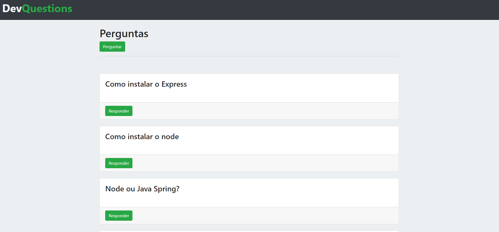

<h1 align="center"> DevQuestions</h1>

Programa desenvolvido por PabloGomesz com o intuito de botar em pratica meus conhecimentos em NodeJS e Express 

  <a href="#-tecnologias">Tecnologias</a>&nbsp;&nbsp;&nbsp;|&nbsp;&nbsp;&nbsp;
  <a href="#-projeto">Projeto</a>&nbsp;&nbsp;&nbsp;|&nbsp;&nbsp;&nbsp;

 

  

## 🚀 Tecnologias

Esse projeto foi desenvolvido com as seguintes tecnologias:

- EJS
- Bootstrap
- NodeJs
- Express
- Git e Github

## 💻 Projeto

O devQuestions é uma plataforma de perguntas e respostas onde o usuario submete sua pergunta podendo outro usuario responder.

